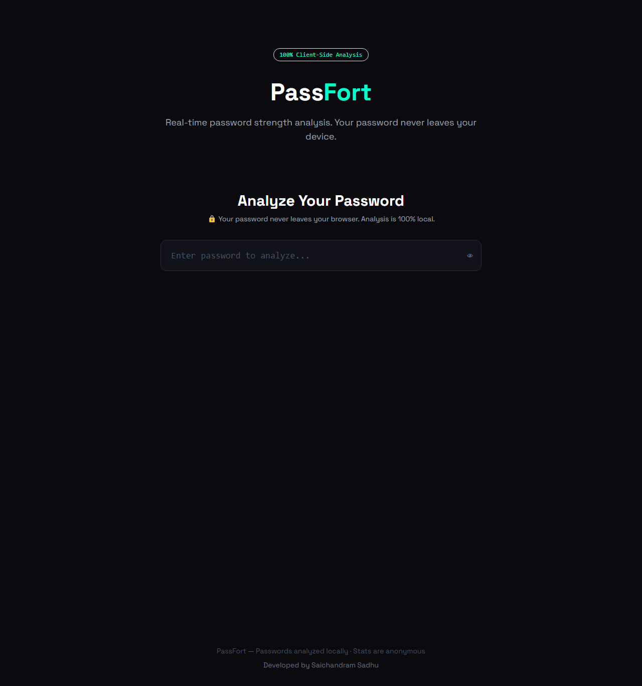
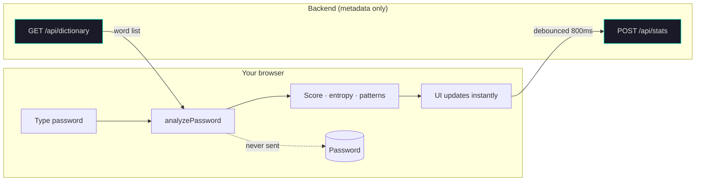
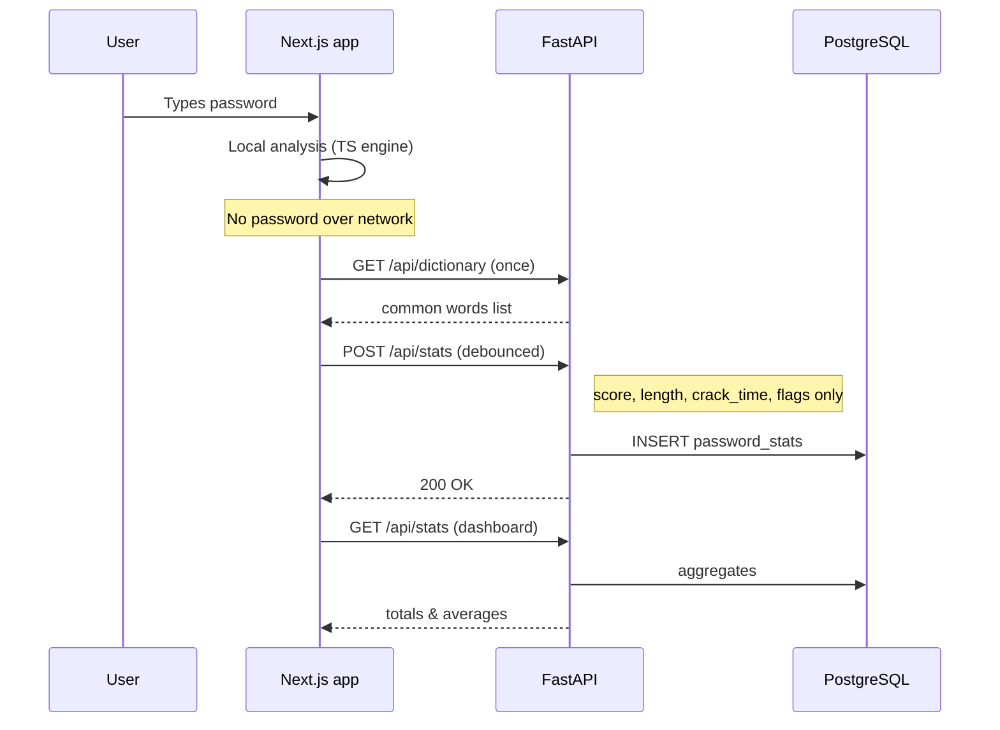
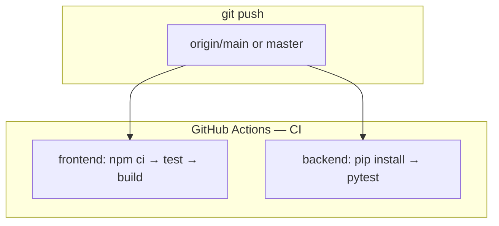
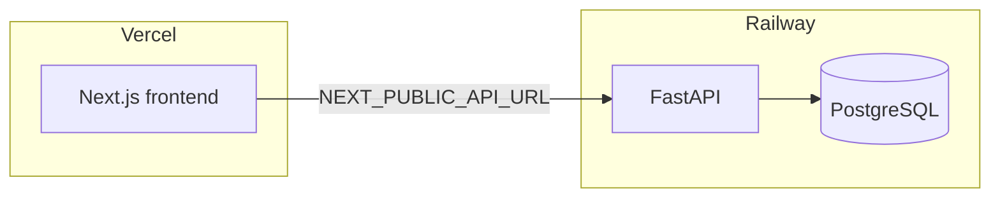

# PassFort

[](https://saichandram-sadhu.github.io/passfort/)
[](#quick-start)
[](https://github.com/saichandram-sadhu/passfort/actions/workflows/ci.yml)
[](https://github.com/saichandram-sadhu/passfort/actions/workflows/deploy-pages.yml)

A full-stack password strength analyzer. Passwords are analyzed entirely in your browser — nothing sensitive ever leaves your device.

**Live site (frontend):** [saichandram-sadhu.github.io/passfort](https://saichandram-sadhu.github.io/passfort/) — auto-deployed from `master` via GitHub Actions. Dictionary + global stats need a deployed API; set `NEXT_PUBLIC_API_URL` in the Pages workflow when your backend URL is ready (see [Deploy](#deploy)).

## Screenshot



## How it works (animated diagrams)

GitHub renders these **Mermaid** diagrams when you view this file on the web.

### User & privacy flow



### Request sequence (dictionary + stats)



### CI pipeline (GitHub Actions)

Runs on every push to `master` / `main` (see [`.github/workflows/ci.yml`](.github/workflows/ci.yml); copy lives in [`docs/ci-workflow.yml`](docs/ci-workflow.yml)).



### Deploy overview



## Project Structure

```
passfort/
├── frontend/   # Next.js 14 + Tailwind + Framer Motion + Three.js + GSAP
├── backend/    # FastAPI + PostgreSQL
├── docs/       # Screenshot + CI workflow backup (`ci-workflow.yml`)
└── .github/workflows/  # CI (GitHub Actions)
```

## Features

- **Real-time strength analysis** — instant scoring as you type
- **Entropy calculator** — bits of randomness with tier labels
- **Crack time estimator** — brute force, dictionary, and rainbow table
- **Pattern detector** — keyboard walks, repeated chars, leet speak, dates
- **Password generator** — random (CSPRNG) and EFF passphrase modes
- **Anonymous global stats** — no passwords stored, ever
- **Three.js particle background** with GSAP scroll animations
- **Privacy first** — 100% client-side analysis

## Quick start

### Frontend (Next.js)

```bash
cd frontend
npm install
cp .env.example .env.local   # set NEXT_PUBLIC_API_URL to your API origin
npm run dev        # http://localhost:3000
npm run build
npm test
```

### Backend (FastAPI)

```bash
cd backend
python -m venv .venv
# Windows: .venv\Scripts\activate
# macOS/Linux: source .venv/bin/activate
pip install -r requirements.txt
cp .env.example .env
# Optional: SKIP_DB_INIT=1 if PostgreSQL is not running yet
uvicorn main:app --reload --host 127.0.0.1 --port 8000
pytest tests/ -v
```

## Deploy

### 1. GitHub (done)

**Repository:** [github.com/saichandram-sadhu/passfort](https://github.com/saichandram-sadhu/passfort)

```bash
git remote add origin https://github.com/saichandram-sadhu/passfort.git   # if missing
git push -u origin master
```

**Note:** If `git push` ever rejects changes under `.github/workflows/` (OAuth `workflow` scope), paste from [`docs/ci-workflow.yml`](docs/ci-workflow.yml) in the GitHub UI, or run `gh auth refresh -s workflow` and push again.

### 2. Backend → [Railway](https://railway.app)

1. New project → add **PostgreSQL**.
2. Deploy from GitHub repo; set **root directory** to `backend/`.
3. Variables:

   | Variable | Value |
   |----------|--------|
   | `DATABASE_URL` | Use the variable Railway injects from PostgreSQL (backend rewrites `postgresql://` → `postgresql+asyncpg://`). |
   | `ALLOWED_ORIGINS` | Your Vercel URL, e.g. `https://passfort.vercel.app` |
   | `PORT` | Railway sets this automatically. |

4. After deploy, copy the public API URL (e.g. `https://xxx.up.railway.app`).

### 3. Frontend

**Option A — GitHub Pages (already wired)**  
Workflow: [`.github/workflows/deploy-pages.yml`](.github/workflows/deploy-pages.yml).  
Add a [repository secret](https://github.com/saichandram-sadhu/passfort/settings/secrets/actions) **`NEXT_PUBLIC_API_URL`** (e.g. your Railway API URL, no trailing slash). Re-run **Deploy GitHub Pages** so the build embeds it. Put `https://saichandram-sadhu.github.io` in Railway **`ALLOWED_ORIGINS`**.

**Option B — [Vercel](https://vercel.com)**  
Import the repo; **root directory** `frontend/`. Set `NEXT_PUBLIC_API_URL` to your API. For Vercel, do **not** set `NEXT_PUBLIC_BASE_PATH` (leave unset so `basePath` is empty in `next.config.mjs`).

### Local API without PostgreSQL

For quick demos, start the API with **`SKIP_DB_INIT=1`**. Dictionary routes work; stats endpoints need a real database.

## Architecture (text)

```
Browser
  ├── analyzePassword()     ← pure TS, no network for the secret
  ├── generateRandom()      ← crypto.getRandomValues
  ├── generatePassphrase()  ← EFF wordlist, lazy-loaded
  └── (debounced) POST /api/stats  ← score/metadata only

FastAPI
  ├── GET  /api/dictionary  → common-passwords list (cached)
  ├── POST /api/stats       → anonymous row (rate limited)
  └── GET  /api/stats       → global aggregates

PostgreSQL
  └── password_stats (score, length, crack_time_seconds, charset_flags, …)
```

## Developer

Developed by **Saichandram Sadhu**.

## License

MIT — use freely; no warranty.
